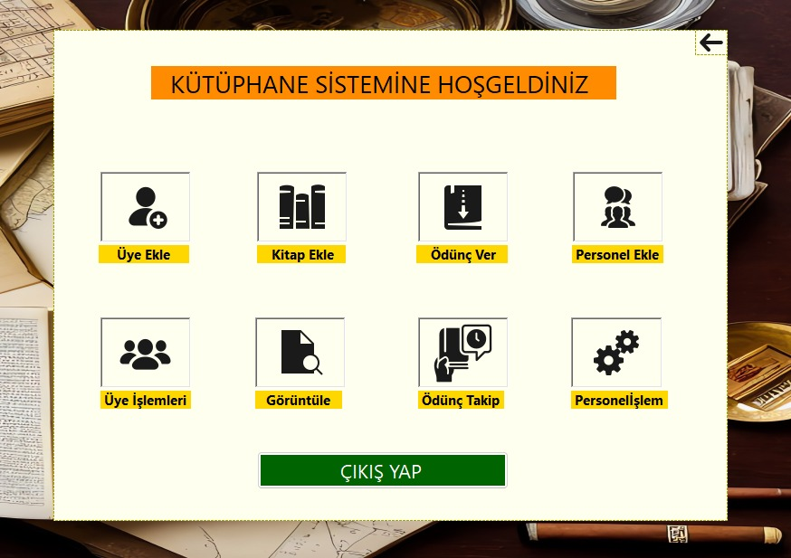
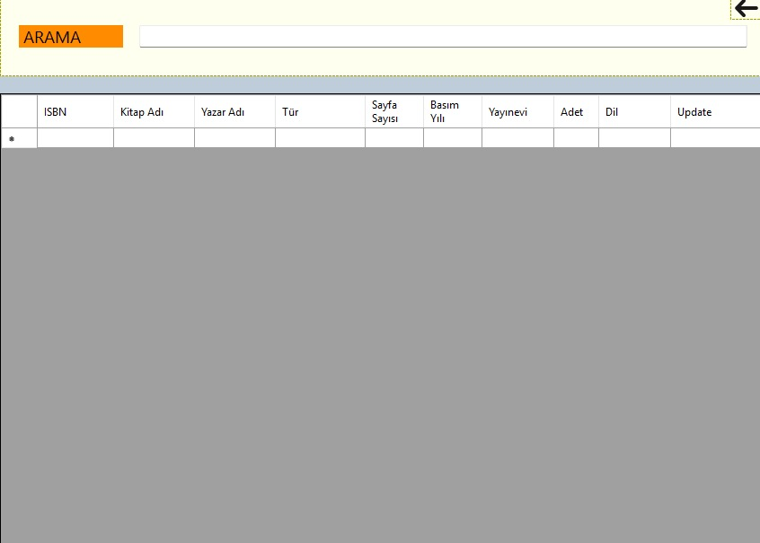
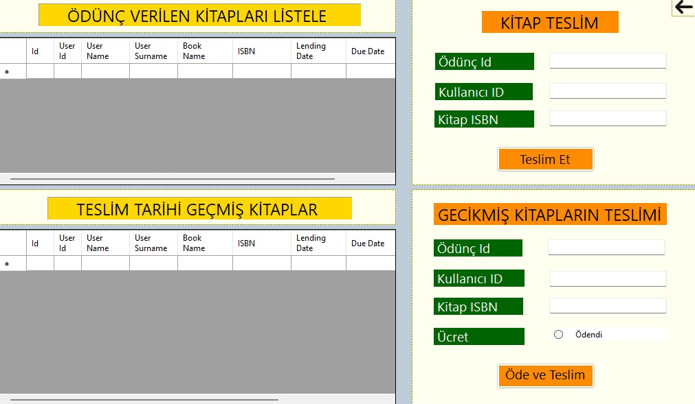
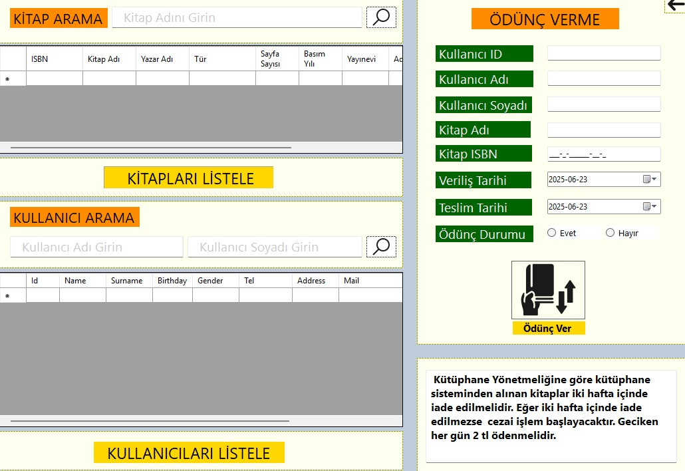

# 📚 Library Management System

## 🔍 Overview
This is a modern **Library Management System** developed using **C#** and **MySQL**. The application allows efficient book management, user registration, and borrowing operations through a user-friendly desktop interface.

## ⚙️ Technologies Used
- C# (.NET Framework)
- MySQL
- Windows Forms (WinForms)

## 🚀 Features
- Add, update, and delete books
- Register and manage users
- Borrow and return books
- View book availability and user history

### 📸 Screenshots

#### 🔐 Login Screen


#### 📚 Book List Screen


#### ➕ Delete Update Book Form


#### 👤 Book Return 


#### 🔄 Borrow


## 🧪 How to Run
1. Clone the repository:
   ```bash
   git clone https://github.com/EdanurKuruoglu/library-management-system.git
2. In Program.cs, update the connection string with your own MySQL server name and password:
    string connectionString = "server=localhost;user=root;password=YOUR_PASSWORD;database=library_db;";
3. Build and run the project.
